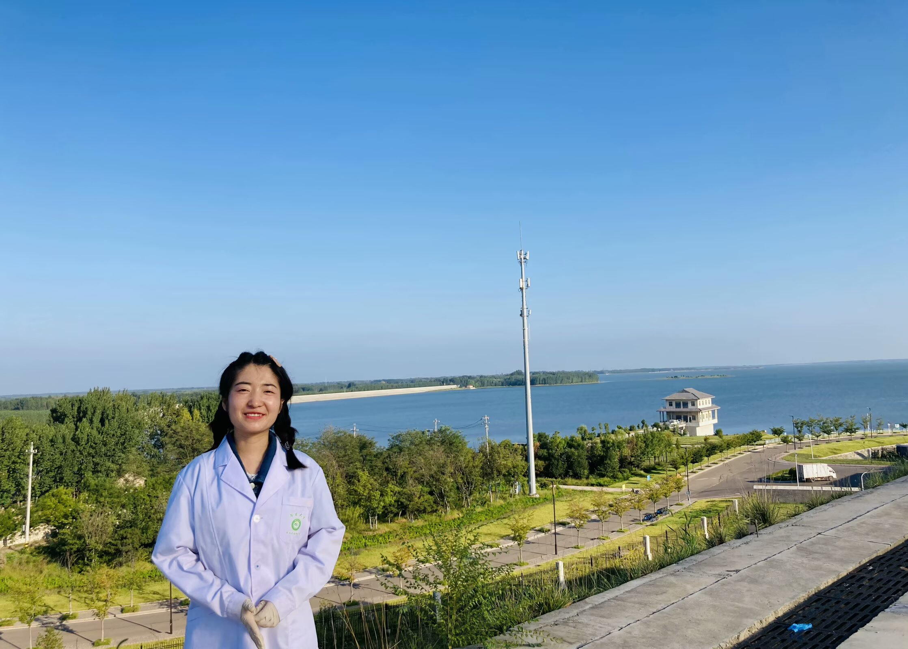

---
# Display name
title: Yamei Wang (王亚梅)

# Full name (for SEO)
first_name: Yamei
last_name: Wang

# Username (this should match the folder name)
authors:
  - 王亚梅

# Is this the primary user of the site?
superuser: false

# Role/position
role: Joint PhD Students

# Organizations/Affiliations
organizations:
  - name: PKU-IAAS
    url: ''

# Short bio (displayed in user profile at end of posts)
bio: My research interests focus on Molecular regulatory mechanism of the initiation of strawberry fruit development and Analysis of the molecular regulatory network of strawberry fruit quality traits.

interests:
  - Stress resistance biology of strawberry and candidate gene mining
  - Effects and mechanisms of AMF *Arbuscular mycorrhiza* on strawberry growth
  - Development of haploid breeding technology for strawberry

education:
  courses:
    - course: M.Ag. in Agronomy and Seed Industry
      institution: Ludong University
      year: 2023
    - course: B.Ag. in Horticulture
      institution: Xinjiang Agricultural University
      year: 2020

# Social/Academic Networking
# For available icons, see: https://docs.hugoblox.com/getting-started/page-builder/#icons
#   For an email link, use "fas" icon pack, "envelope" icon, and a link in the
#   form "mailto:your-email@example.com" or "#contact" for contact widget.
social:
  - icon: envelope
    icon_pack: fas
    link: 'mailto:1711918208@qq.com'
  #- icon: twitter
  #  icon_pack: fab
  #  link: https://twitter.com/GeorgeCushen
  #- icon: google-scholar
  #  icon_pack: ai
  #  link: https://scholar.google.co.uk/citations?user=sIwtMXoAAAAJ
  #- icon: github
  #  icon_pack: fab
  #  link: https://github.com/gcushen
# Link to a PDF of your resume/CV from the About widget.
# To enable, copy your resume/CV to `static/files/cv.pdf` and uncomment the lines below.
# - icon: cv
#   icon_pack: ai
#   link: files/cv.pdf

# Enter email to display Gravatar (if Gravatar enabled in Config)
email: '1711918208@qq.com'

# Organizational groups that you belong to (for People widget)
#   Set this to `[]` or comment out if you are not using People widget.
user_groups:
  #- Researchers
  #- Visitors
  - Research Assistants
---

Yamei Wang is a Research Assistant at the DBSGI Research Group. She is always passionate about her research work🙋, full of expectations💡, and never anxious🌱. She said that insisting on anxiety will make her dormant(hahaha). In addition, when she writes, she will especially want to buy things, such as once buying a 5 4-piece set and 3 summer quilts. She has a wide range of hobbies, such as playing badminton🎾, but she is always abused; in addition, she also likes reading📖, although reading has nothing to do with scientific research; oh, by the way, she also likes writing📝, usually recording what she dreamed of yesterday. In addition, she once jokingly ranked that she was also a new type of three-good student😎: good body, good heart, and good mentality.

**王亚梅**是草莓发育生物学与种质资源创新实验室科研助理，她总是对自己的研究工作充满热情🙋，满怀期待💡，从不焦虑🌱。她说若是焦虑会自我休眠（hahahaha）。另外，她写文章时会特别想买东西，比如说曾经一次买了五个四件套和三个夏凉被。她的爱好很广泛，比如打羽毛球🎾，不过总是被虐；此外她还特别喜欢读书📖，虽然读的和科研没什么相关；哦对了，同时她也特别喜欢写作📝，一般都是记录昨天做了什么梦。另外她曾打趣地说道她还是新型三好学生获得者😎：身体好，心眼好，心态好。

