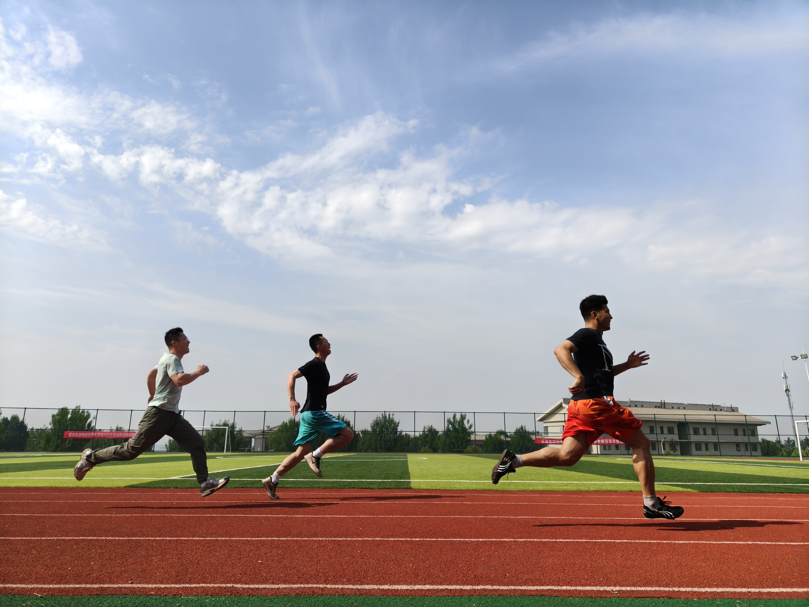
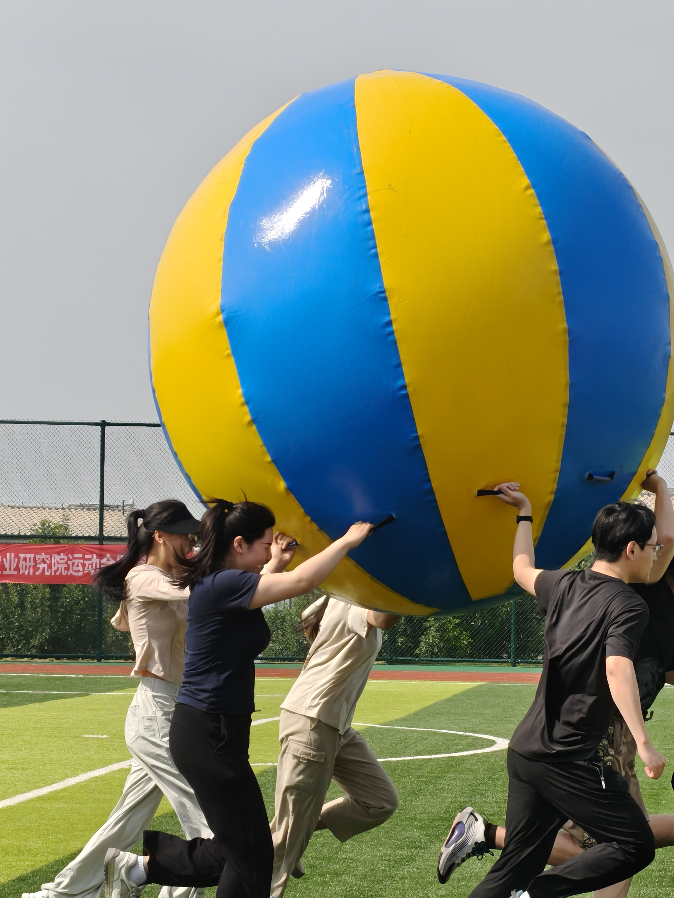
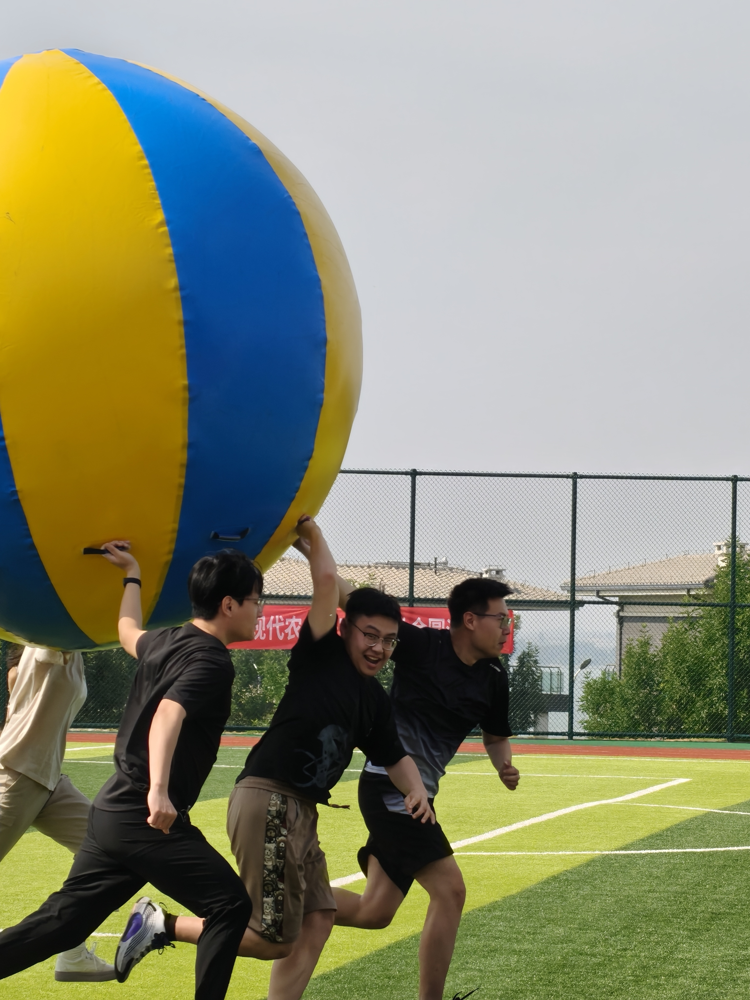

2025年6月6日，DBSGI研究小组多名成员积极报名2025年北京大学现代农业研究院/山东省现代农业潍坊实验室运动会项目（五子棋，踢毽子，100米短跑，运转乾坤团体项目等）并取得优异成绩。
<!--more-->

On June 6, 2025, several members of DBSGI research group actively signed up for the 2025 PKU-IAAS Games (Gobang, shuttlecock kicking, 100-meter sprint, running the universe team events, etc.) and achieved excellent results.

🌟 恭喜[韩先焱](https://junhui-zhou.github.io/zhoulab.github.io/author/xianyan-han-%E9%9F%A9%E5%85%88%E7%84%B1/)获得男子100米第三名 ！

🌟 恭喜[翟文慧](https://junhui-zhou.github.io/zhoulab.github.io/author/wenhui-zhai-%E7%BF%9F%E6%96%87%E6%85%A7/)获得踢毽子比赛第三名 ！

🌟 恭喜[侯德鑫](https://junhui-zhou.github.io/zhoulab.github.io/author/dexin-hou-%E4%BE%AF%E5%BE%B7%E9%91%AB/)获得五子棋比赛第二名 ！

🌟 恭喜[刘大琦](https://junhui-zhou.github.io/zhoulab.github.io/author/daqi-liu-%E5%88%98%E5%A4%A7%E7%90%A6/)、田震、[郑孟卓](https://junhui-zhou.github.io/zhoulab.github.io/author/mengzhuo-zheng-%E9%83%91%E5%AD%9F%E5%8D%93/)、[孙妍](https://junhui-zhou.github.io/zhoulab.github.io/author/yan-sun-%E5%AD%99%E5%A6%8D/)、[翟文慧](https://junhui-zhou.github.io/zhoulab.github.io/author/wenhui-zhai-%E7%BF%9F%E6%96%87%E6%85%A7/)、刘安舒获得运转乾坤团体比赛第三名 ！

特别感谢行政助理[赵秀莲](https://junhui-zhou.github.io/zhoulab.github.io/author/xiulian-zhao-%E8%B5%B5%E7%A7%80%E8%8E%B2/)女士提供的图片 ~

Special thanks to administrative assistant Ms. [Xiulian Zhao](https://junhui-zhou.github.io/zhoulab.github.io/author/xiulian-zhao-%E8%B5%B5%E7%A7%80%E8%8E%B2/) for providing the pictures ~

