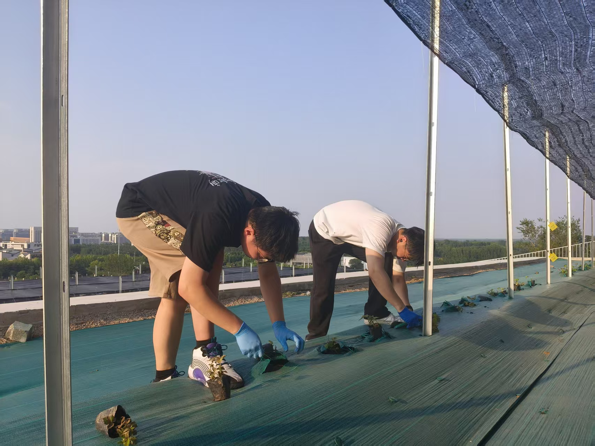
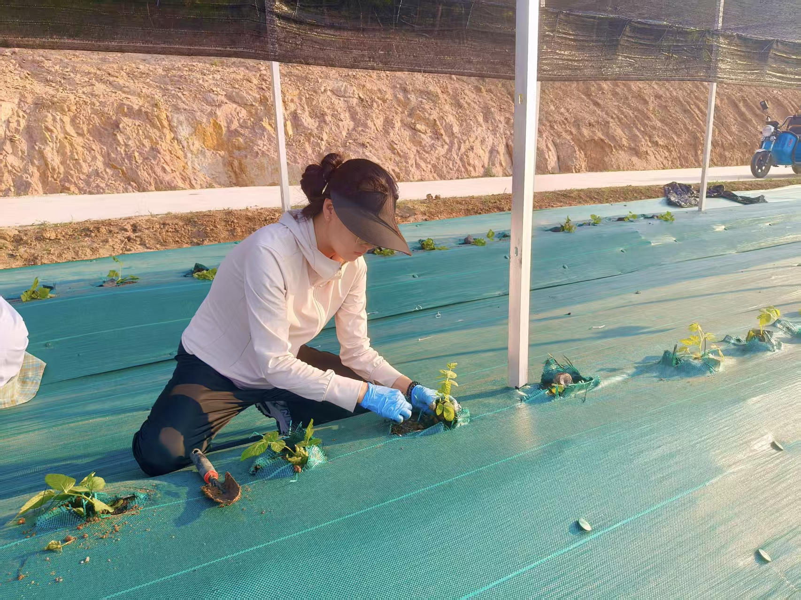
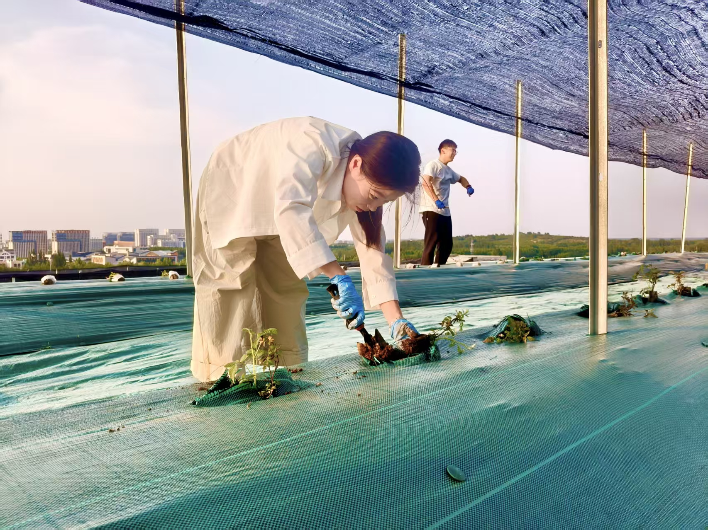

2025年5月27日-28日，DBSGI研究小组C组、D组和树莓组在课题组长[周军会](https://junhui-zhou.github.io/zhoulab.github.io/author/junhui-zhou-%E5%91%A8%E5%86%9B%E4%BC%9A/)博士和行政助理[孙妍](https://junhui-zhou.github.io/zhoulab.github.io/author/yan-sun-%E5%AD%99%E5%A6%8D/)女士的安排下共同参与了一场公共活动，主要栽种草莓苗子及购买的400株树莓栽培种。

<!--more-->

On May 27-28, 2025, Under the arragements of Dr. [Junhui Zhou](https://junhui-zhou.github.io/zhoulab.github.io/author/junhui-zhou-%E5%91%A8%E5%86%9B%E4%BC%9A/) and administrative assistant Ms. [Yan Sun](https://junhui-zhou.github.io/zhoulab.github.io/author/yan-sun-%E5%AD%99%E5%A6%8D/), C, D and raspberry group of DBGSI participated in a public event together, mainly planting strawberry seedlings and purchasing 400 raspberry plants.

特别感谢各位DBSGI课题组成员的积极参与 ~

Special thanks to the members of the DBSGI research group for their active participation ~

(无奖竞猜：哪个是**大琦**哪个是**德鑫**？)

