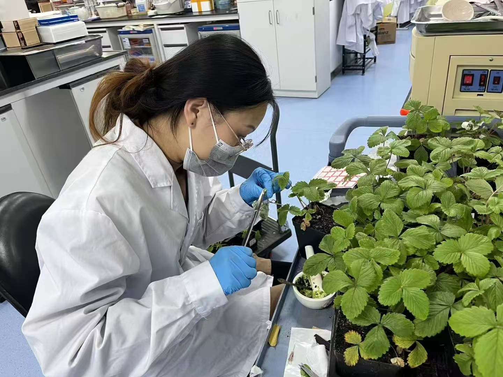
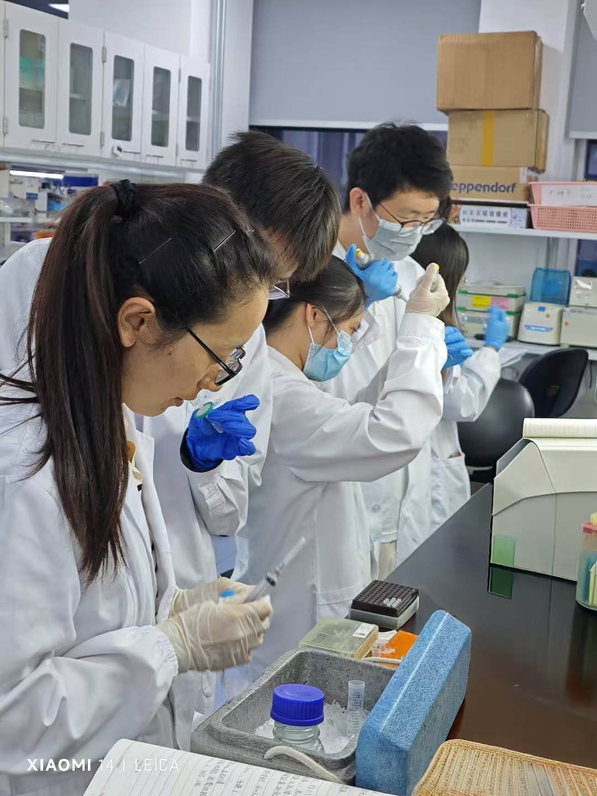
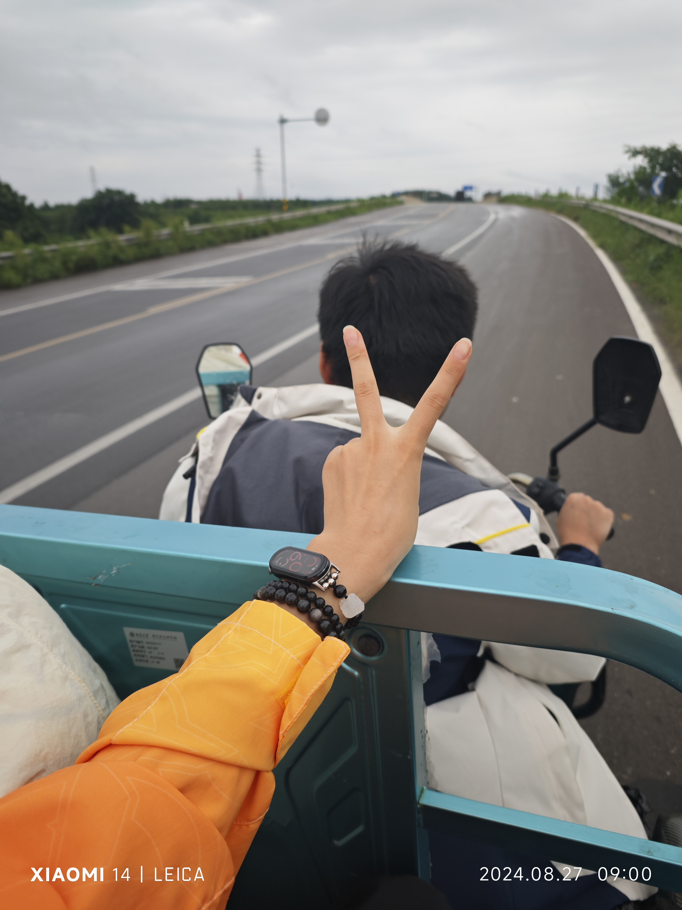
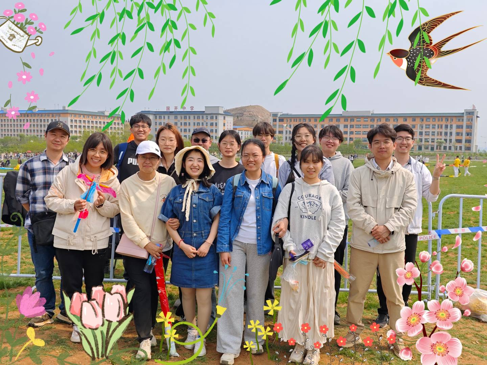
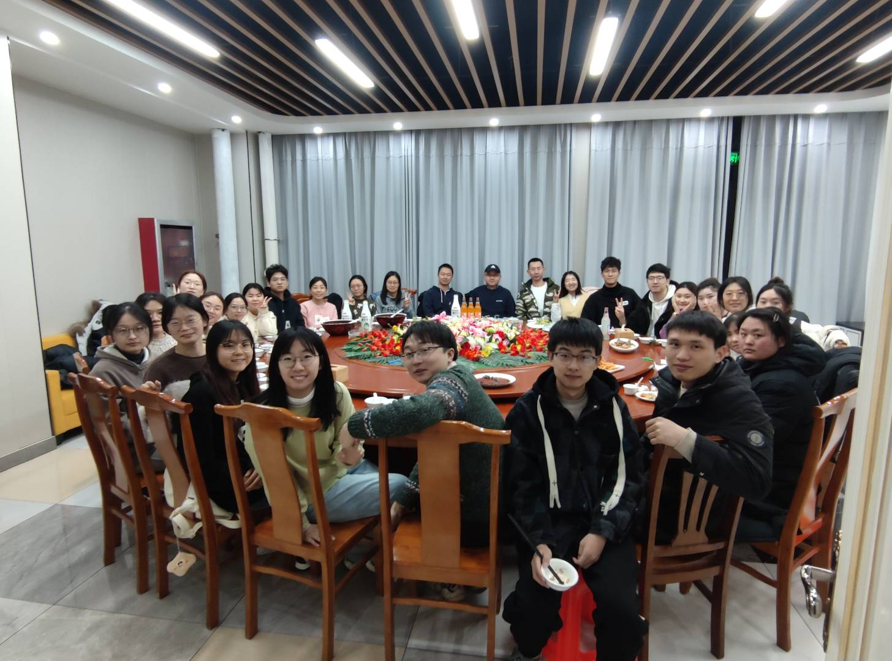
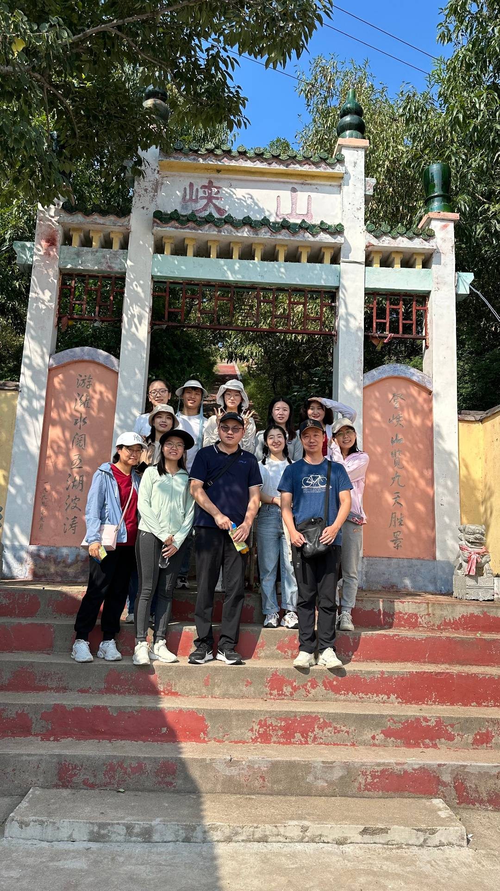
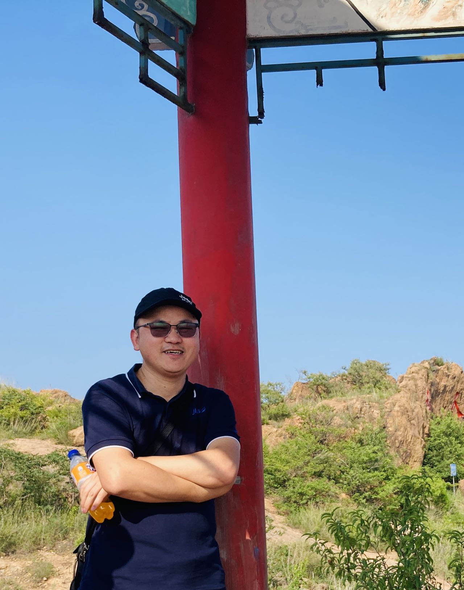
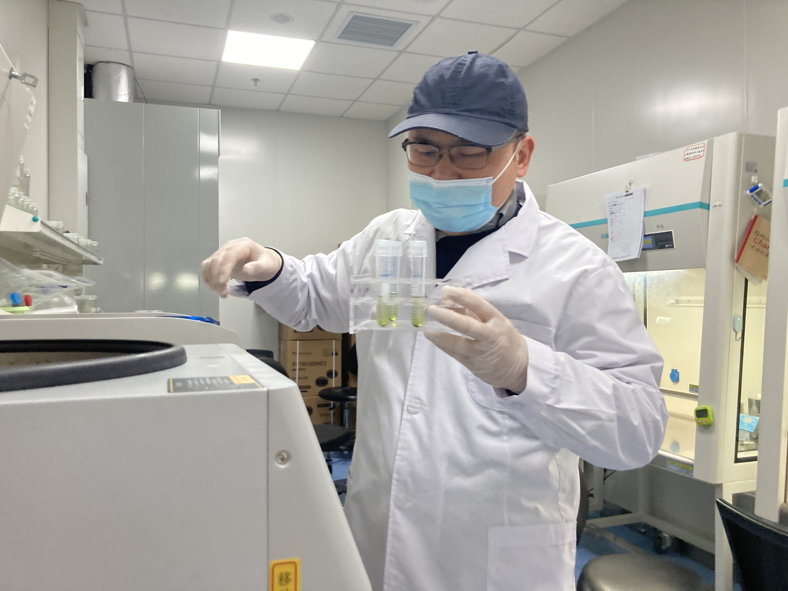
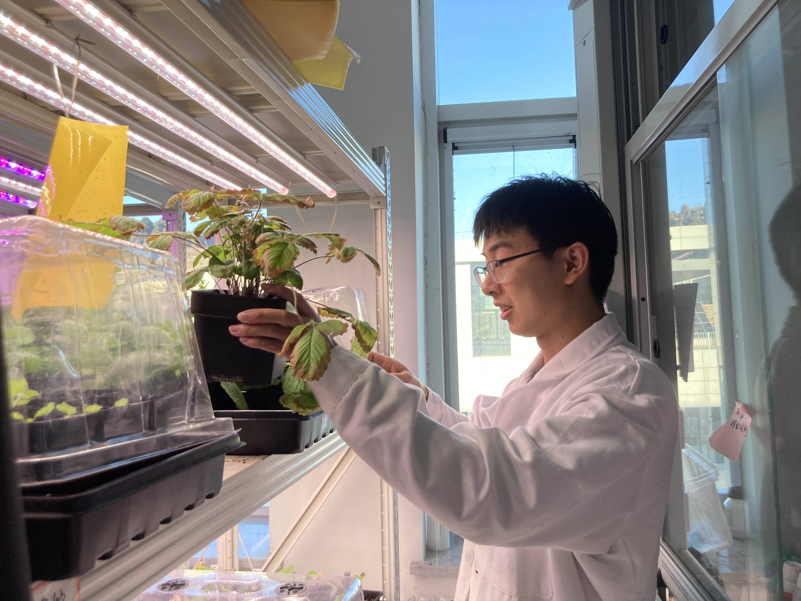
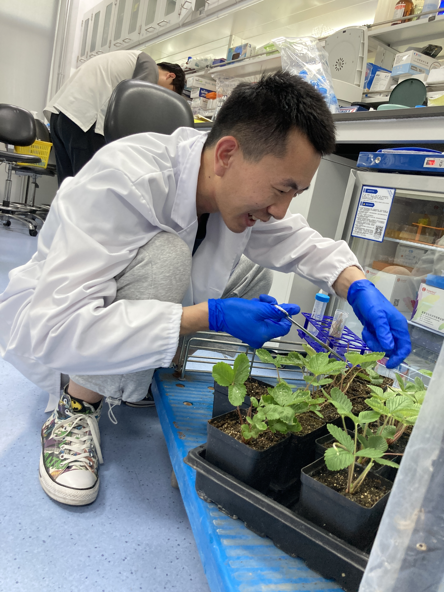

🌱【北京大学现代农业研究院DBSGI研究小组相册集】🌱  
🌟 [Chronicles: PKU-IAAS DBSGI Group] 🌟

<!--more-->

这里是北京大学现代农业研究院（PKU-IAAS）旗下专注于草莓和树莓发育生物学研究的DBSGI课题组！自2020年周军会研究员组建以来，我们持续深耕草莓和树莓农业科学研究领域。于此特别整理了一批实验室的工作、聚餐和游玩照片，以作纪念。

As a research group under the ​Peking University of Institute of Advanced Agricultural Sciences (PKU-IAAS), DBSGI is ​dedicated to developmental biology research in strawberries and raspberries! Since its establishment in 2020 by Principal Investigator ​Dr. Junhui Zhou, our lab has been at the forefront of advancing berry agricultural science. Today, we’re excited to share a collection of snapshots capturing our journey—from intense lab sessions to joyful team gatherings and memorable outings. Each photo tells a story of innovation, camaraderie, and growth. 🌱✨

特别感谢[**王亚梅**](https://junhui-zhou.github.io/zhoulab.github.io/author/yamei-wang-%E7%8E%8B%E4%BA%9A%E6%A2%85/)女士和[**孙妍**](https://junhui-zhou.github.io/zhoulab.github.io/author/yan-sun-%E5%AD%99%E5%A6%8D/)女士提供的照片~

Special thanks to [​**Ms. Yamei Wang** (Research Assistant)](https://junhui-zhou.github.io/zhoulab.github.io/author/yamei-wang-%E7%8E%8B%E4%BA%9A%E6%A2%85/) and [**Ms. ​Yan Sun** (Administrative Assistant)](https://junhui-zhou.github.io/zhoulab.github.io/author/yan-sun-%E5%AD%99%E5%A6%8D/) for contributing these photographs.

