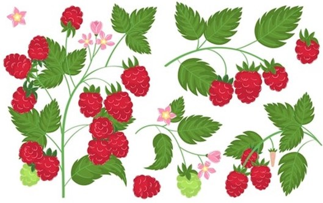
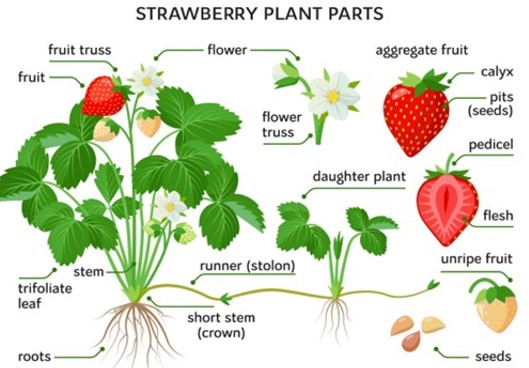
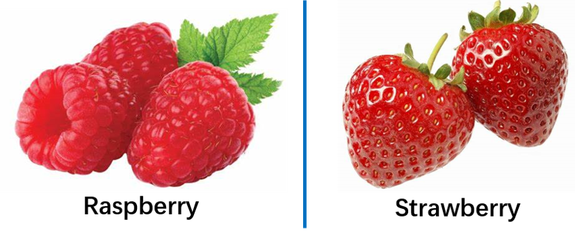
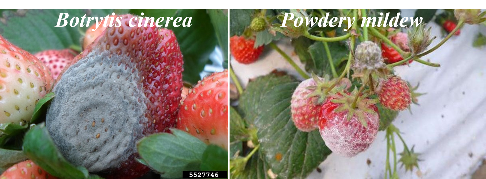
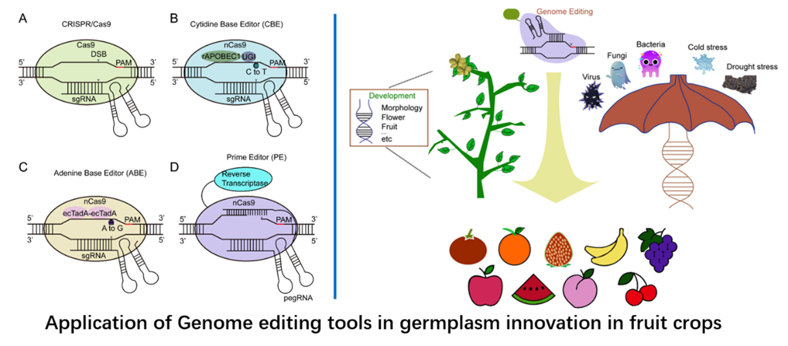
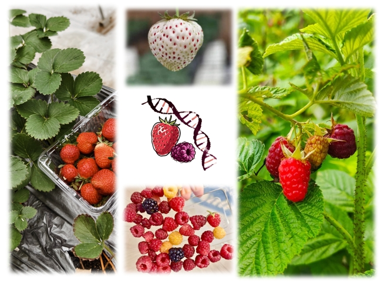

# Research Introduction

**DBSGI**(Developmental Biology of Strawberry & Germplasm Innovation) research group is led by Dr. [Junhui Zhou](https://junhui-zhou.github.io/zhoulab.github.io/author/junhui-zhou-%E5%91%A8%E5%86%9B%E4%BC%9A/), which is affiliated with [Peking University of Institute of Advanced Agricultural University(PKU-IAAS)](https://www.pku-iaas.edu.cn/).
**DBSGI**（草莓发育生物学与种质创新）研究小组于由课题组长[周军会](https://junhui-zhou.github.io/zhoulab.github.io/author/junhui-zhou-%E5%91%A8%E5%86%9B%E4%BC%9A/)博士领导，隶属于[北京大学现代农业大学研究院 (PKU-IAAS)](https://www.pku-iaas.edu.cn/)。

The **strawberry** is one of the most important small berry crops in the world, with China's cultivation area and yield ranking first globally for a long time. Strawberries have characteristics such as a relatively short growth cycle (4-6 months), being perennial, and capable of asexual reproduction (via stolons). Particularly in recent years, with advancements in genome annotation, the development of transgenic systems, and gene-editing systems, strawberries have gradually evolved into a model species for studying fruit development mechanisms and plant-microbe interactions.

Rubus (raspberry) boasts abundant wild germplasm resources, mostly diploid, with a relatively small genome (300 Mb). Its fruits are rich in SOD, ellagic acid, and various vitamins, exhibiting physiological activities such as antioxidant, anti-aging, anti-inflammatory, cardiovascular disease prevention, and skin-whitening properties.

Our research group focuses on *Fragaria vesca* (2n), cultivated strawberry (8n), and raspberry (2n) as primary subjects, integrating multi-omics technologies, molecular biology techniques, cell biology methods, and molecular genetics approaches to investigate:

**1).** Elucidate the molecular mechanisms underlying the fleshy fruit initiation and developmental diversity in different Rosaceae species, which was recently found to be regulated by crosstalk among phytohormone signaling，fruit “identity” genes ，and epigenetic factors; 

**2).** Demonstrate the regulation pathways for fruit architecture and nutrients (Firmness, Sugar accumulation, Vitamin C biosynthesis)

**3).** Investigate the molecular interaction pattern between fungal pathogens (Botrytis cinerea and powdery mildew) and host target genes/gene products, develop new strategies against the fungal pathogen’s invasion. As well as Strawberry-abiotic stress interaction.

**4).** Develop new genome editing tools (Prime editing, Base editing) for gene functional study in strawberry and raspberry, and achieve germplasm improvement and de novo domestication of strawberry and raspberry.

**5).** Germplasm collection and developmental biology of Rubus genus.

草莓是世界上最重要的小浆果之一，其中我国的草莓种植面积和产量长期居世界首位。草莓具有生长周期相对较短(4-6月)、多年生、可以无性繁殖(匍匐茎)等特点，特别是近年来随着基因组注释的完善、转基因体系和基因编辑体系的开发，草莓逐渐发展成为研究果实发育机制、植物-微生物互作的一种模式物种。悬钩子属（Rubus）树莓具有丰富的野生种质资源且多为二倍体，基因组较小（300Mb），其果实富含SOD、鞣花酸和各种维生素，具有抗氧化、抗衰老、抗炎症、预防心血管疾病和美白皮肤等生理活性。课题组以森林草莓（2n）、栽培草莓（8n）和树莓（2n）为主要研究对象，结合多组学技术、分子生物学技术、细胞生物学技术和分子遗传学技术探究：(1). 草莓肉质果发育起始及蔷薇科果实作物肉质果发育多样性的遗传机制；(2). 草莓树莓果实品质调控的分子机制；(3). 草莓主要真菌病害（灰霉病、白粉病）的致病机理及分子抗病育种策略的开发；(4). Rubus资源收集及其各种发育性状特征的遗传机制；(5). 园艺作物基因编辑体系的优化及应用；以基因编辑为基础的草莓树莓分子设计育种策略开发。

Welcome doctoral and master's students and young scholars who are interested in the **DBSGI research group** to join us and develop together!

欢迎对**DBSGI研究小组**研究感兴趣的博士和硕士学生以及年轻学者加入我们，共同发展！

Email: junhui.zhou@pku-iaas.edu.cn
